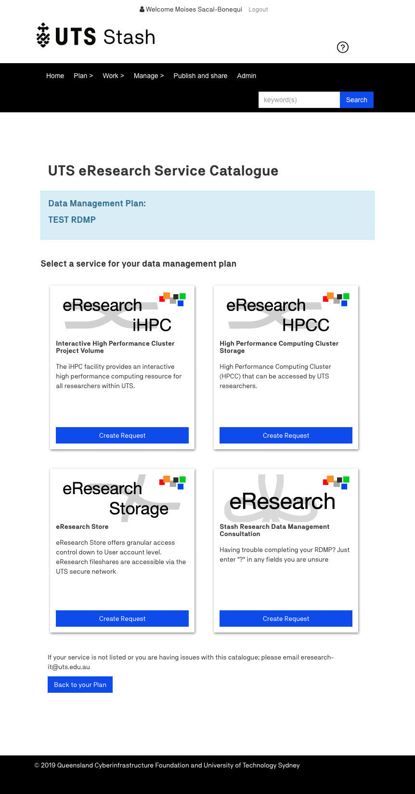
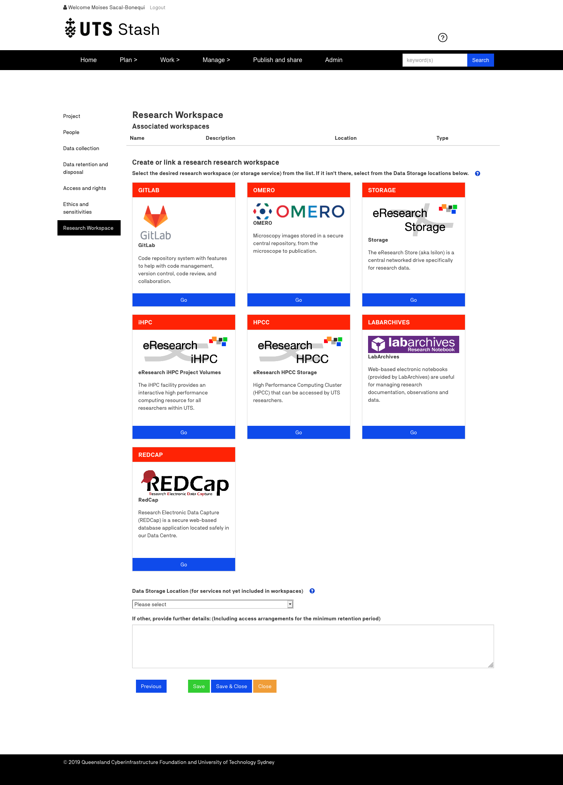
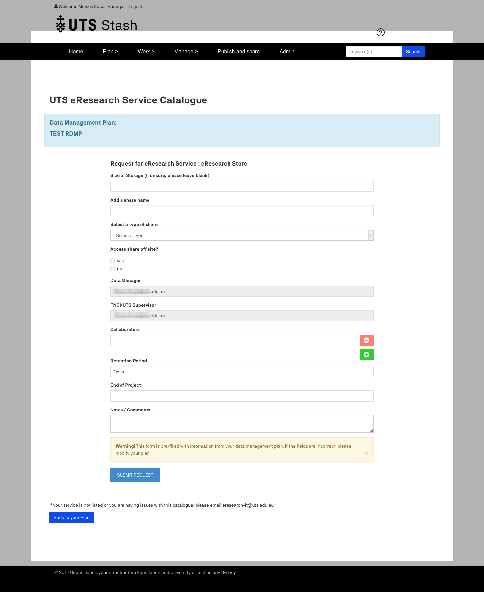

## A Sails Hook Redbox Catalog

A sails hook that adds service-now integration into redbox-portal

## api

Main API of your Hook can be stored in controllers and services

- controllers
- services
  
## config & form-config

This configurations are redbox-portal dependent. They will allow redbox to be available as a record
If you require to have a form in your portal

- `config/recordtype`
- `config/workflow`
- `form-config/catalog-1.0-draft`

## index

Main entry point for the hook

### initialize

Init code before it gets hooked. 

### routes

Controller routes exposed to the sails front-end

```javascript
  'post /:branding/:portal/ws/catalog/rdmp': CatalogController.rdmpInfo,
  'post /:branding/:portal/ws/catalog/request': CatalogController.request
```

### configure

Configuration and services to your sails app

```javascript
  sails.services['CatalogService'] = CatalogService;
```

## Development in redbox-portal

A docker-compose.yml file is present in support/development and is setup to run the full ReDBox stack and install the hook. To run the stack there is a ReDBox Sails Hook Run Utility in the root of the project

### Usage #1
```
ReDBox Sails Hook Run Utility
Usage: ./runForDev.sh [-a|--(no-)angular] [-h|--help]
	-a,--angular,--no-angular: Angular mode. Will ensure permissions are set correctly on the Sails working directory so that changes can be applied (off by default)
	-h,--help: Prints help
```

Note: The first time the stack runs it may take some time as yarn initialises the hook within ReDBox Portal. All subsequent runs should be faster

### Usage #2

Using Vagrant : https://github.com/moisbo/vagrant-redbox-dev

And configure sync

config.vm.synced_folder "{source}/sails-hook-redbox-catalog", "/opt/hooks/sails-hook-redbox-catalog", id: "catalog"

## Example:

Service Catalog as stand alone hook:

http://localhost:1500/default/{branding}/catalog/edit?rdmp={redbox_oid}



Or integrated into rdmp



Example: eResearch Storage




